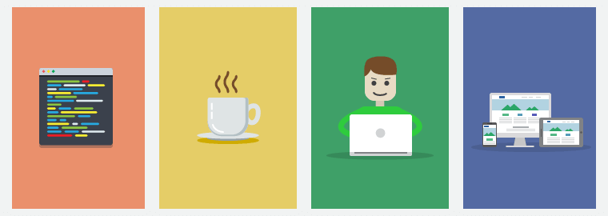

# 1. 前端开发简介

关于前端的定义各自有各自的理解，甚至不同的公司对前端岗位有不同的定义与技术要求。

而一般将「用户可视区域」的功能实现都划分为前端开发的范畴，如 Web 界面、手机端的界面、各类大小屏幕的界面甚至一些嵌入式设备的界面（冰箱上都能下单购物了？）。

## 1.1 基础技术架构

前端最基础的技术架构肯定是最基础的 HTML、CSS、JavaScript 三个好朋友，HTML 负责页面结构展示，

