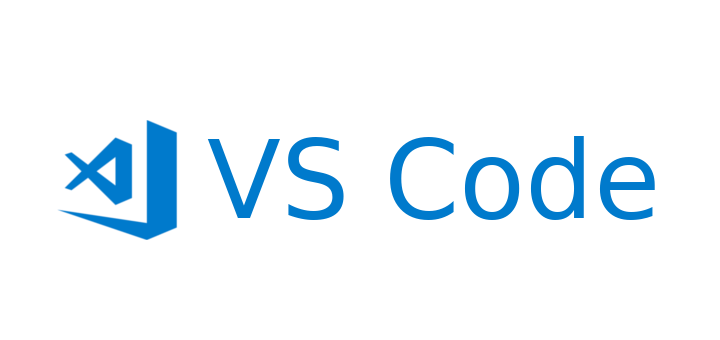

# 3.  搭建一个前端学习的基础环境

## 电脑选择篇

如果经济允许推荐选择 Mac，选择 Windows 也没啥问题，主要看自己用的顺手就行。

## 基础开发工具 \(IDE\)

对于前端开发的初学者，只需要安装一个编辑器就可以满足目前的学习需求，那就是目前最热门、最受欢迎的编辑器 VSCode。

> Visual Studio Code \(简称 VS Code / VSC\) 是一款免费开源的现代化轻量级代码编辑器，支持几乎所有主流的开发语言的语法高亮、智能代码补全、自定义快捷键、括号匹配和颜色区分、代码片段、代码对比 Diff、Git 命令等特性，支持插件扩展，并针对网页开发和云端应用开发做了优化。软件跨平台支持 Windows、Mac 以及 Linux，运行流畅，可谓是微软的良心之作。

VSCode 以其优化的性能以及极其丰富的插件库受到了开发者的欢迎，可以算是一个开发者必装的编辑器了，用来进行前端的学习入门代码编辑器绰绰有余。


如果你想学习 VSCode 的基本使用，下面我的原创教程应该可以帮助到你。

\[\[原创\] VSCode 高效开发必装插件系列视频教程\]\([https://devopen.club/course/vscode](https://devopen.club/course/vscode)\)

\[VSCode 必装的 10 个高效开发插件\]\([http://blog.parryqiu.com/2018/10/15/vscode\_top\_ten\_plugins/](http://blog.parryqiu.com/2018/10/15/vscode_top_ten_plugins/)\)


